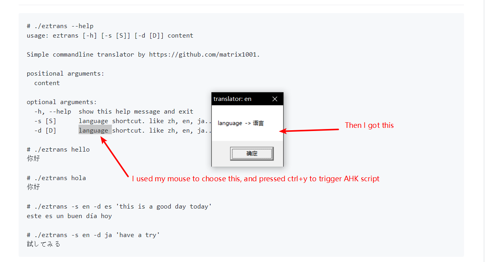

# eztrans
check the source code for more information. default is using google api (accessable from mainland)
# usage
```
# ./eztrans --help
usage: eztrans [-h] [-s [S]] [-d [D]] content

Simple commandline translator by https://github.com/matrix1001

positional arguments:
  content

optional arguments:
  -h, --help  show this help message and exit
  -s [S]      language shortcut. like zh, en, ja......
  -d [D]      language shortcut. like zh, en, ja......

# ./eztrans hello
你好

# ./eztrans hola
你好

# ./eztrans -s en -d es 'this is a good day today'
este es un buen día hoy

# ./eztrans -s en -d ja 'have a try'
試してみる
```

# use with msgserver and autohotkey
run this at first
```
git submodule init && git submodule update
```
i have written `msgserver` to oppose python api to http server.

run the `ahk` script and the `server`, then use your mouse to choose any text.

press ctrl+y and you will get a messagebox giving you the result of the translation.

example:

